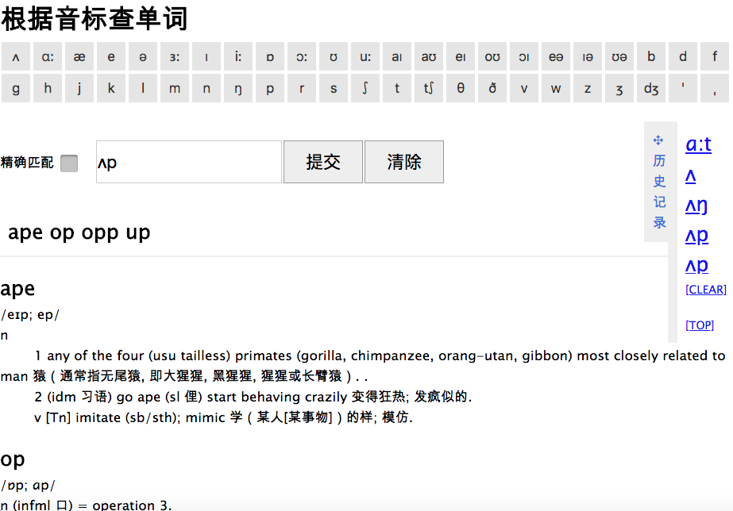

# IPA
Lookup english phonetic symbol for the words, using python as backend.

## Usage

1. startup **mongodb @ 27017**, then run `startup.sh`, now it's only works on linux/macOS, for windows you need config to run `cgi` script.

2. open `index.html` from browser.

